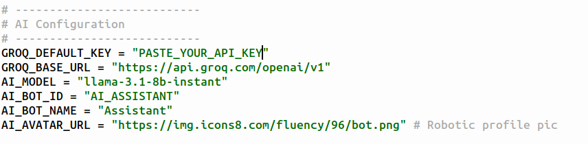

# ZYLO LINK

<!-- BADGES -->


---

## 🚀 Overview

**ZYLO LINK** is a fully self-hosted, real-time communication platform designed to demonstrate how modern chat systems can be built cleanly, efficiently, and independently using Python. It combines a low-latency WebSocket backend with a premium, responsive frontend to deliver instant messaging, media sharing, live presence, and AI-assisted conversations—without relying on external cloud services.

Unlike traditional chat applications that depend on managed platforms or heavyweight stacks, ZYLO LINK is intentionally engineered as a **single-file deployment architecture** (beyond standard Python libraries). The entire user interface—HTML, CSS, and JavaScript—is embedded directly inside the backend, eliminating external templates and static pipelines. This design keeps the system portable, auditable, and extremely fast to deploy while still offering a modern glassmorphism UI comparable to commercial chat platforms.

ZYLO LINK also integrates an **AI assistant powered by Groq-hosted LLMs** using direct HTTP APIs instead of SDKs, ensuring compatibility with constrained environments such as Android (Termux). The project serves both as a production-ready private chat system and a reference architecture for real-time, event-driven applications.

> **Private • Real-Time • Self-Hosted • AI-Enhanced**

---

## 🖼️ Interface Preview

<p align="center">
  
</p>

<p align="center">
  
</p>

<p align="center">
  
</p>

<p align="center">
  
</p>

---

## ✨ Key Features

* ⚡ Real-time messaging using WebSockets (Flask-SocketIO)
* 👥 Private and group chat rooms
* 🤖 Built-in AI Assistant powered by **Groq LLMs** (HTTP-based, SDK-free)
* 🧠 Context-aware AI responses
* 🖼️ Live avatar upload and synchronization
* 📎 File & media sharing (images, videos, documents)
* 💾 Persistent message storage using SQLite
* 🔐 Local authentication (no OAuth, no third-party login)
* 🎨 Ultra-premium glassmorphism UI
* 📱 Fully responsive (desktop & mobile)
* 🧩 Fully embedded frontend (single-file deployment)

---

## 🧠 Technology Stack

### Backend

* Python 3.9+
* Flask
* Flask-SocketIO
* Eventlet (async networking)
* SQLite
* Requests (Groq API integration)

### Frontend

* HTML5
* CSS3 (Glassmorphism Design)
* Vanilla JavaScript
* Font Awesome Icons

---

## 📂 Project Structure

```text
.
├── message.py          # Complete backend + embedded frontend
├── uploads/            # Uploaded avatars & shared files
├── assets/             # UI screenshots and media
├── ZYLO_chat.db        # SQLite database (auto-generated)
└── README.md
```

> ⚠️ No templates or static folders required. The UI is fully embedded in `message.py`.

---

## 🏁 Getting Started

### 1️⃣ Clone the Repository

```bash
git clone https://github.com/your-username/ZYLO-LINK.git
cd ZYLO-LINK
```

### 2️⃣ Install Dependencies

```bash
pip install flask flask-socketio eventlet werkzeug requests
```

### 3️⃣ Run the Application

```bash
python message.py
```

### 4️⃣ Open in Browser

```text
http://127.0.0.1:5000
```

---

## 🔑 Groq API Key Setup

ZYLO LINK uses **Groq LLMs** for AI-assisted chat. You must provide your own API key.

1. Generate a key from:
   [https://console.groq.com/keys](https://console.groq.com/keys)

2. Export it as an environment variable:

```bash
export GROQ_API_KEY="your_groq_api_key_here"
```

<p align="center">
  
</p>

---

## 🌐 Access From Internet (ngrok)

To expose ZYLO LINK beyond your local network:

1. Login: [https://dashboard.ngrok.com/login](https://dashboard.ngrok.com/login)

2. Copy Authtoken: [https://dashboard.ngrok.com/get-started/your-authtoken](https://dashboard.ngrok.com/get-started/your-authtoken)

3. Install ngrok:

```bash
wget https://bin.equinox.io/c/bNyj1mQVY4c/ngrok-v3-stable-linux-amd64.tgz
tar -xvzf ngrok-v3-stable-linux-amd64.tgz
sudo mv ngrok /usr/local/bin
```

4. Add your authtoken:

```bash
ngrok config add-authtoken YOUR_AUTHTOKEN
```

5. Start tunneling:

```bash
ngrok http 5000
```

<p align="center">
  
</p>

> **Note:** ngrok URLs are temporary unless you use a paid plan.

---

## 🔐 Authentication Model

* Users are auto-registered on first login
* Each user receives a unique **10-character ID**
* IDs are used to:

  * Start private chats
  * Add members to group chats
* No cloud-based authentication required

---

## 💬 Chat System

* One-to-one private messaging
* Group chats with:

  * Member addition
  * Chat renaming
  * Chat deletion
* System-generated messages for chat events
* Message history auto-loaded on room join

---

## 📎 File Upload System

* Inline image preview
* Embedded video playback
* Downloadable file cards
* Upload progress indicator
* MIME-type–aware rendering

---

## 🖼️ Avatar System

* Profile picture upload
* Real-time avatar updates across all chats
* Cache-busting for instant refresh

---

## ⚙️ Configuration

Edit inside `message.py`:

```python
app.config['MAX_CONTENT_LENGTH'] = 100 * 1024 * 1024  # 100 MB
app.config['UPLOAD_FOLDER'] = 'uploads'
```

---

## 🛡️ Security Notes

* Designed for local or trusted environments
* Passwords are stored in plain text (prototype scope)
* For production use:

  * Add password hashing (bcrypt / argon2)
  * Enable HTTPS (reverse proxy)
  * Harden file upload validation

---

## 📦 Deployment

ZYLO LINK can run on:

* Local machines
* LAN servers
* VPS environments
* Android (Termux)
* Docker containers

No external services are required beyond an optional Groq API key.

---

## 📜 License

This project is licensed under the **MIT License**.

---

## 👤 Author

**Swapnanil Guin**
Student • Developer • System Architect
Part of the **ZYLO Ecosystem**

---

## ⭐ Final Words

ZYLO LINK proves that **high-quality, real-time communication systems can be built independently**, without cloud lock-in or heavyweight frameworks.

If this project helped you, consider giving it a ⭐ on GitHub.
