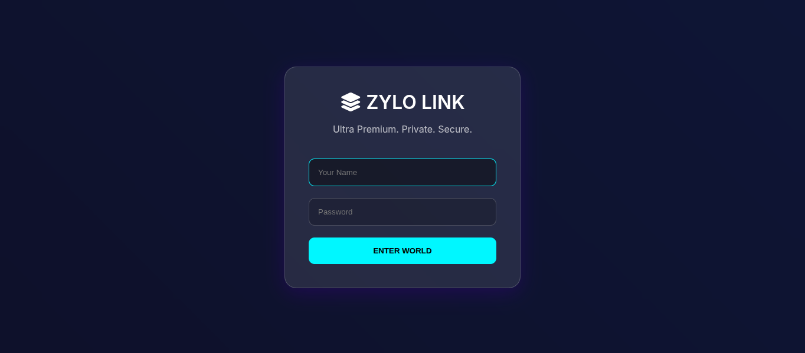
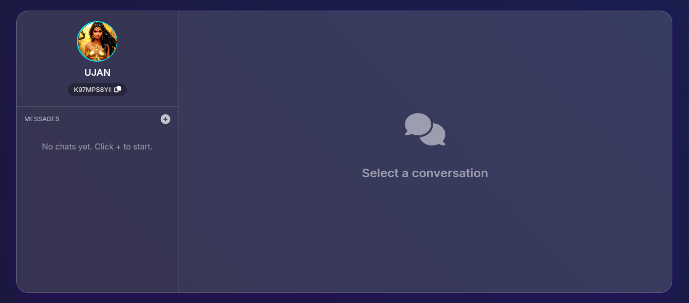
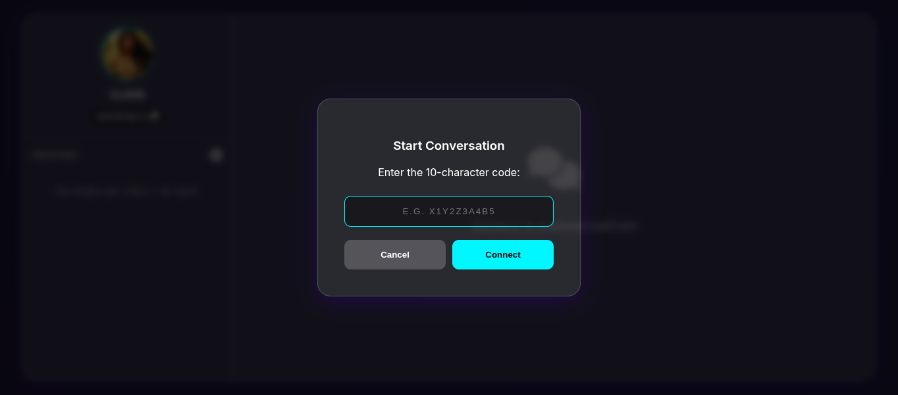
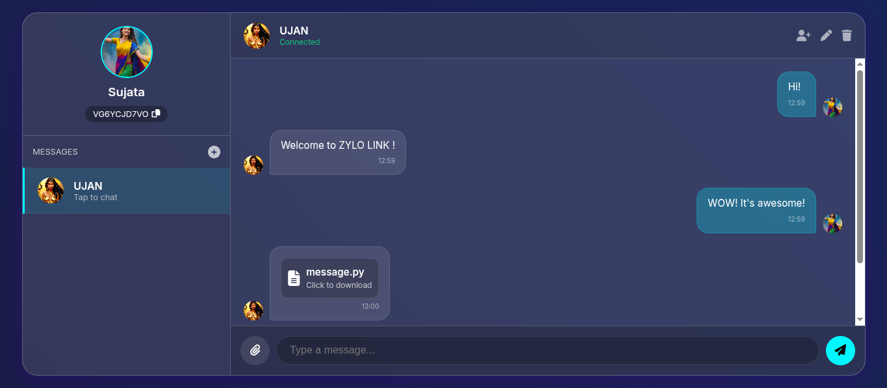
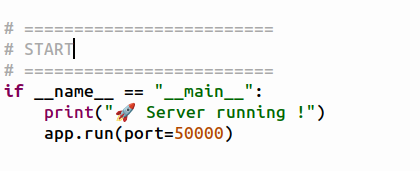

# 💎 ZYLO LINK

<!-- BADGES -->


## 🚀 Overview

ZYLO LINK is a fully self-hosted, real-time communication platform designed to demonstrate how modern chat systems can be built cleanly, efficiently, and independently using Python. The project combines a low-latency WebSocket backend with a premium, responsive frontend to deliver instant messaging, media sharing, and live user presence without relying on external cloud services or third-party APIs. Every component—from authentication and room management to file uploads and avatar synchronization—is handled locally, giving full control over data, performance, and deployment.

Unlike traditional chat applications that depend on heavyweight stacks or managed services, ZYLO LINK is intentionally engineered as a single-file, zero-dependency deployment model (beyond Python libraries). The entire user interface is embedded directly into the backend, eliminating the need for separate template engines or static asset pipelines. This makes the system easy to run, audit, and extend, while still delivering a visually modern glassmorphism UI and real-time interactivity comparable to commercial messaging platforms.

At its core, ZYLO LINK serves both as a practical messaging solution and as a reference architecture for real-time systems. It showcases event-driven design using WebSockets, persistent state management with SQLite, and live synchronization of user data across multiple clients. The project is particularly suited for learning, experimentation, LAN deployments, and privacy-focused environments where full ownership of infrastructure is essential.

> **Private • Real-Time • Fully Controlled**

<p align="center">
  
</p>

<p align="center">
  
</p>

<p align="center">
  
</p>

<p align="center">
  
</p>

---

## ✨ Key Features

* ⚡ Real-time messaging using WebSockets
* 👥 Private & group chat rooms
* 🖼️ Live avatar upload & instant synchronization
* 📁 File & media sharing (images, videos, documents)
* 💾 Persistent message storage using SQLite
* 🔐 Local authentication (no third-party login)
* 🎨 Ultra-premium glassmorphism UI
* 📱 Fully responsive (desktop & mobile)
* 🛠️ Fully embedded frontend (single-file deployment)

---

## 🧠 Technology Stack

### Backend

* Python 3.9+
* Flask
* Flask-SocketIO
* Eventlet (async networking)
* SQLite

### Frontend

* HTML5
* CSS3 (Glassmorphism Design)
* Vanilla JavaScript
* Font Awesome Icons

---

## 📂 Project Structure

```
.
├── message.py          # Complete backend + frontend
├── uploads/            # Uploaded avatars & shared files
├── ZYLO_chat.db        # SQLite database (auto-generated)
└── README.md
```

> ⚠️ No templates or static folders required. The UI is fully embedded.

---

## 🏁 Getting Started

### 1️⃣ Clone the Repository

```bash
git clone https://github.com/your-username/ZYLO-LINK.git
cd ZYLO-LINK
```

### 2️⃣ Install Dependencies

```bash
pip install flask flask-socketio eventlet werkzeug
```

### 3️⃣ Run the Application

```bash
python message.py
```

### 4️⃣ Open in Browser

```
http://127.0.0.1:5000
```

#### Access from Internet:
To access the running server from anywhere from the world, beyond the wifi, one may use ngrok.
##### Follow these Steps:
- Login: https://dashboard.ngrok.com/login
- Copy the Authtoken: https://dashboard.ngrok.com/get-started/your-authtoken
- To download ngrok paste in terminal:
```bash
wget https://bin.equinox.io/c/bNyj1mQVY4c/ngrok-v3-stable-linux-amd64.tgz
```
```bash
tar -xvzf ngrok-v3-stable-linux-amd64.tgz
```
```bash
sudo mv ngrok /usr/local/bin
```
- To add the Authtoken, paste:
```bash
ngrok config add-authtoken $YOUR_AUTHTOKEN
```
(Replace $YOUR_AUTHTOKEN with the copied Authtoken.)
- Now paste:
```bash
ngrok http 50051
```
(50051 is the port. One can change it as wanted, but also ensure to change it in python code.)
<p align="center">
  
</p>

- After it, one will see output similar to:
```bash
Forwarding  https://xxxx-xxxx.ngrok-free.app -> http://localhost:50051
```
- Copy
```https://xxxx-xxxx.ngrok-free.app```
and paste at any browser to get started.

**Note:** The URL is not static.
---

## 🔐 Authentication Model

* Users are auto-registered on first login
* Each user receives a unique **10-character ID**
* IDs are used to:

  * Start private chats
  * Add users to group chats
* No cloud authentication required

---

## 💬 Chat System

* One-to-one private messaging
* Group chats with:

  * Member addition
  * Chat renaming
  * Chat deletion
* System-generated messages for chat events
* Message history auto-load on join

---

## 📎 File Upload System

* Inline image preview
* Embedded video playback
* Downloadable file cards
* Upload progress bar
* MIME-type based handling

---

## 🖼️ Avatar System

* Profile picture upload
* Real-time avatar sync across chats
* Cache-busting for instant updates

---

## ⚙️ Configuration

Edit inside `message.py`:

```python
app.config['MAX_CONTENT_LENGTH'] = 100 * 1024 * 1024  # 100MB
app.config['UPLOAD_FOLDER'] = 'uploads'
```

---

## 🛡️ Security Notes

* Designed for local / trusted networks
* Passwords are stored in plain text (prototype scope)
* For production use:

  * Add password hashing
  * Enable HTTPS
  * Harden file upload validation

---

## 📦 Deployment

ZYLO LINK can run on:

* Local machines
* LAN servers
* VPS environments
* Docker (recommended)

No external services required.

---

## 📜 License

This project is licensed under the **MIT License**.

---

## 👤 Author

**Swapnanil Guin**
Student • Developer • System Architect
Part of the **ZYLO Ecosystem**

---

## ⭐ Final Words

ZYLO LINK proves that **powerful real-time communication systems can be built independently**, without cloud lock-in or third-party dependencies.

If this project helped you, consider starring ⭐ the repository.
